# Patrones de Diseño
## Un primer acercamiento - generalidades

*"Each pattern describes a problem which occurs over and over again in our environment, and then describes the core of the solution to that problem, in such a way that you can use this solution a million times over, without ever doing it the same way twice"* [Christopher Alexander].

## Introducción

El diseño de software orientado a objetos es, en cierta forma, difícil, si a esta tarea sumamos que el software diseñado debe tener ciertas características deseables como la reusabilidad, flexibilidad y portabilidad entre otras, la tarea es aun más difícil.

Algo que conocen muy bien los diseñadores con cierta experiencia, es que no se puede afrontar cada problema desde cero, por lo general reutilizan soluciones que han trabajado en el pasado y que han representado buenas soluciones a los problemas planteados.

Si estas soluciones les sirven de manera  recurrente y  estas les brindan las características deseables en el software mencionadas arriba, probablemente se encuentran ante un patrón de diseño.

## ¿Qué son los patrones de diseño?
Los patrones de diseño son la base para la búsqueda de soluciones a problemas comunes en el desarrollo de software y otros ámbitos referentes al diseño de interacción o interfaces.

    Un patrón de diseño es una solución a un problema de diseño.

Los patrones de diseño son un conjunto de prácticas de óptimo diseño que se utilizan para abordar problemas recurrentes en la programación orientada a objetos.

El concepto de patrones de diseño fue el resultado de un trabajo realizado por un grupo de 4 personas Erich Gamma, Richard Helm, Ralph Johnson y John Vlissides, (Gang of four) que se publicó en los 90s en un libro titulado "Design Patterns. Elements of Reusable Object-Oriented Software" en el que se esbozaban 23 patrones de diseño.

Un patrón de diseño puede considerarse como un documento que define una estructura de clases que aborda una situación particular. Para que una solución sea considerada un patrón debe poseer ciertas características. Una de ellas es que debe haber comprobado su efectividad resolviendo problemas similares en ocasiones anteriores. Otra es que debe ser reusable, lo que significa que es aplicable a diferentes problemas de diseño en distintas circunstancias.

Los patrones de diseño representa un nivel de abstracción un poco mas elevado de lo que hasta ahora el estudiante esta habituado a trabajar, pero una vez entendido su funcionamiento y utilidad, los diseños serán mucho más flexibles, modulares y reutilizables.
En esencia un patrón tiene los siguientes 4 elementos:

- **Nombre del patrón:** describe el problema de diseño, su solución y consecuencias en una o dos palabras.
- **El problema:** describe cuando aplicar el patrón, explica el problema y su contexto.
- **La solución:** describe los elementos del diseño, sus relaciones, responsabilidades y colaboraciones. No describe la implementación o un diseño particular específicamente ya que se adapta mas a una plantilla (template) que puede ser aplicada a varias situaciones.
- **Las consecuencias:** son los resultados de aplicar el patrón, los pros y contras de su aplicación. Las consecuencias de la aplicación de un patrón debe incluir el impacto en la flexibilidad, extensibilidad y/o portabilidad del sistema.

## Estructuras o plantillas de patrones
Para describir un patrón se utilizan plantillas más o menos estandarizadas, de forma que se expresen uniformemente y puedan constituir efectivamente un medio de comunicación uniforme entre diseñadores. La plantilla más común es la utilizada precisamente por el “Gang of Four” y consta de los siguientes apartados:

- **Nombre del patrón:** nombre estándar del patrón por el cual será reconocido en la comunidad (normalmente se expresan en inglés).
- **Clasificación del patrón:** creacional, estructural o de comportamiento.
- **Intención:** ¿Qué problema pretende resolver el patrón?
- **También conocido como:** Otros nombres de uso común para el patrón.
- **Motivación:** Escenario de ejemplo para la aplicación del patrón.
- **Aplicabilidad:** Usos comunes y criterios de aplicabilidad del patrón.
- **Estructura:** Diagramas de clases oportunos para describir las clases que intervienen en el patrón.
- **Participantes:** Enumeración y descripción de las entidades abstractas (y sus roles) que participan en el patrón.
- **Colaboraciones:** Explicación de las interrelaciones que se dan entre los participantes.
- **Consecuencias:** Consecuencias positivas y negativas en el diseño derivadas de la aplicación del patrón.
- **Implementación:** Técnicas o comentarios oportunos de cara a la implementación del patrón.
- **Código de ejemplo:** Código fuente ejemplo de implementación del patrón.
- **Usos conocidos:** Ejemplos de sistemas reales que usan el patrón.
- **Patrones relacionados:** Referencias cruzadas con otros patrones.

## Tipos de patrones
### Patrones de creación
Los patrones de creación abstraen la forma en la que se crean los objetos, permitiendo tratar las clases a crear de forma genérica dejando para más tarde la decisión de qué clases crear o cómo crearlas.

- **Abstract Factory:** Proporciona una interfaz para crear familias de objetos o que dependen entre sí, sin especificar sus clases concretas.

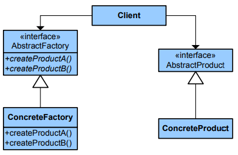

- **Builder:** Separa la construcción de un objeto complejo de su representación, de forma que el mismo proceso de construcción pueda crear diferentes representaciones.

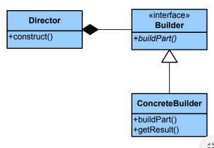

- **Factory Method:** Define una interfaz para crear un objeto, pero deja que sean las subclases quienes decidan qué clase instanciar. Permite que una clase delegue en sus subclases la creación de objetos.

- **Prototype:** Especifica los tipos de objetos a crear por medio de una instancia prototípica, y crear nuevos objetos copiando este prototipo.

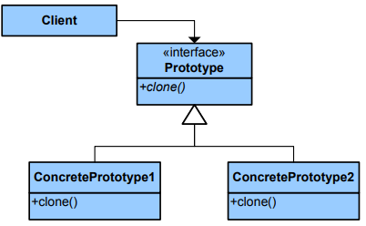

- **Singleton:** Garantiza que una clase sólo tenga una instancia, y proporciona un punto de acceso global a ella.

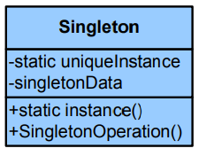

### Patrones estructurales
Tratan de conseguir que cambios en los requisitos de la aplicación no ocasionen cambios en las relaciones entre los objetos. Lo fundamental son las relaciones de uso entre los objetos, y, éstas están determinadas por las interfaces que soportan los objetos.

Estudian como se relacionan los objetos en tiempo de ejecución. Sirven para diseñar las interconexiones entre los objetos.

- **Adapter:** Convierte la interfaz de una clase en otra distinta que es la que esperan los clientes. Permiten que cooperen clases que de otra manera no podrían por tener interfaces incompatibles.

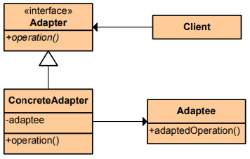

- **Bridge:** Desvincula una abstracción de su implementación, de manera que ambas puedan variar de forma independiente.

- **Composite:** Combina objetos en estructuras de árbol para representar jerarquías de parte-todo. Permite que los clientes traten de manera uniforme a los objetos individuales y a los compuestos.

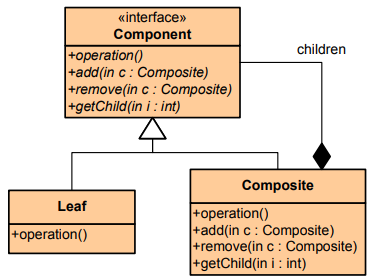

- **Decorator:** Añade dinámicamente nuevas responsabilidades a un objeto, proporcionando una alternativa flexible a la herencia para extender la funcionalidad.

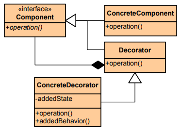

- **Facade:** Proporciona una interfaz unificada para un conjunto de interfaces de un subsistema. Define una interfaz de alto nivel que hace que el subsistema se más fácil de usar.

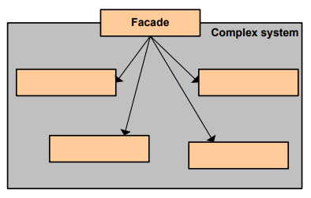

- **Flyweight:** Usa el compartimiento para permitir un gran número de objetos de grano fino de forma eficiente.

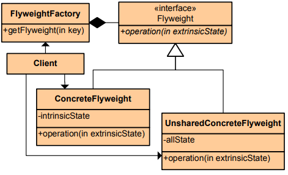

- **Proxy:** Proporciona un sustituto o representante de otro objeto para controlar el acceso a éste.

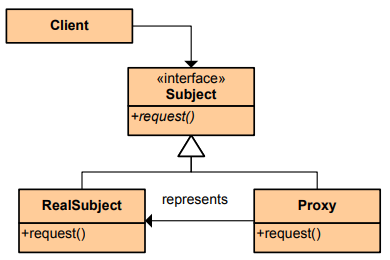

### Patrones de comportamiento
Los patrones de comportamiento estudian las relaciones entre llamadas entre los diferentes objetos, normalmente ligados con la dimensión temporal.

- **Chain of Responsibility:** Evita acoplar el emisor de una petición a su receptor, al dar a más de un objeto la posibilidad de responder a la petición. Crea una cadena con los objetos receptores y pasa la petición a través de la cadena hasta que esta sea tratada por algún objeto.

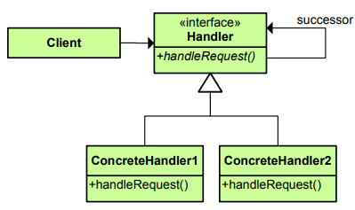

- **Command:** Encapsula una petición en un objeto, permitiendo así parametrizar a los clientes con distintas peticiones, encolar o llevar un registro de las peticiones y poder deshacer la operaciones.

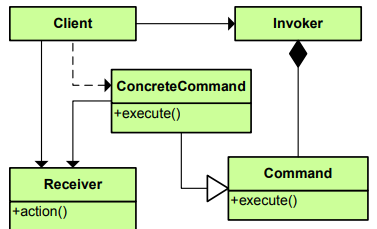

- **Interpreter:** Dado un lenguaje, define una representación de su gramática junto con un intérprete que usa dicha representación para interpretar las sentencias del lenguaje.

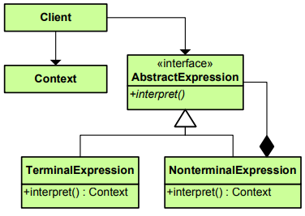

- **Iterator:** Proporciona un modo de acceder secuencialmente a los elementos de un objeto agregado sin exponer su representación interna.

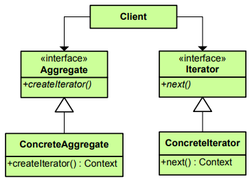

- **Mediator:** Define un objeto que encapsula cómo interactúan un conjunto de objetos. Promueve un bajo acoplamiento al evitar que los objetos se refieran unos a otros explícitamente, y permite variar la interacción entre ellos de forma independiente.

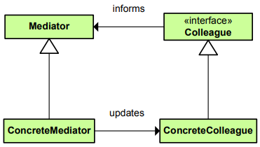

- **Memento:** Representa y externaliza el estado interno de un objeto sin violar la encapsulación, de forma que éste puede volver a dicho estado más tarde.

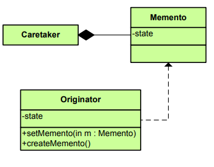

- **Observer:** Define una dependencia de uno-a-muchos entre objetos, de forma que cuando un objeto cambia de estado se notifica y actualizan automáticamente todos los objetos.

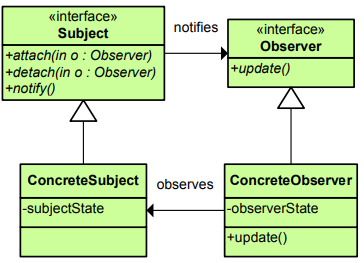

- **State:** Permite que un objeto modifique su comportamiento cada vez que cambia su estado interno. Parecerá que cambia la clase del objeto.

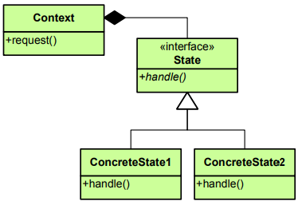

- **Strategy:** Define una familia de algoritmos, encapsula uno de ellos y los hace intercambiables. Permite que un algoritmo varíe independientemente de los clientes que lo usan.

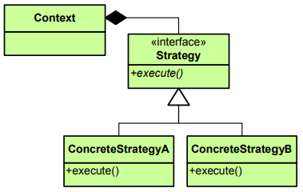

- **Template Method:** Define en una operación el esqueleto de un algoritmo, delegando en las subclases algunos de sus pasos. Permite que las subclases redefinan ciertos pasos del algoritmo sin cambiar su estructura.

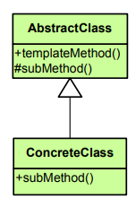

- **Visitor:** Representa una operación sobre los elementos de una estructura de objetos. Permite definir una nueva operación sin cambiar las clases de los elementos sobre los que opera.

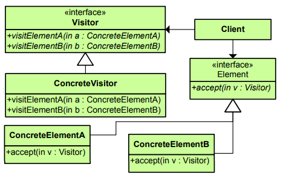

## Referencias bibliográficas
1. Design Patterns. Elements of Reusable Object-Oriented Software - Erich Gamma, Richard Helm, Ralph Johnson, John Vlissides - Addison Wesley (GoF- Gang of Four)
2. Patrones de Diseño, Diseño de Software Orientado a Objetos - Joaquin Garcia. http://www.ingenierosoftware.com/analisisydiseno/patrones-diseno.php.
3. Patrones de diseño -  http://es.kioskea.net/contents/genie-logiciel/design-patterns.php3.
4. Introducción al diseño con patrones – Miguel Lagos Torres. http://www.elrincondelprogramador.com/default.asp?pag=articulos/leer.asp&id=29.
5. Object Oriented Desing “Software Desing Principles and Design Patters, http://www.oodesing.com

*Daza Corredor, Alejandro Paolo*

- Ingeniero de Sistemas, egresado de la Universidad Distrital Francisco José de Caldas
- Especialista de Ingeniería de Software de la Universidad Distrital Francisco José de Caldas.
- Magister en ingeniería y dirección de sitios web de la Universidad Internacional de la Rioja

- Docente del proyecto curricular de Ingeniería de Sistemas en el área de programación de la Universidad Distrital Francisco José de Caldas
- Docente de la especialización en Ingeniería de Software de la Universidad Distrital Francisco José de Caldas
